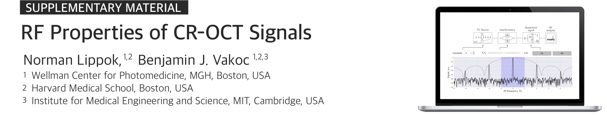

<!--
Norman Lippok1,2, Benjamin J. Vakoc1,2,3  
<i>1Wellman Center for Photomedicine, Massachusetts General Hospital, Boston, MA 02114, USA 
2Harvard Medical School, Boston, MA 02115, USA 
3Institute for Medical Engineering and Science, Massachusetts Institute of Technology, Cambridge, MA 02139, USA 
</i>
-->

This GitHub repository provides a simulation tool as Supplementary Material to our paper entitled *RF Properties of Circular-Ranging OCT Signals*. An interested reader will be able to generate and study CR signals as produced by a monotonically stepped frequency comb source in the RF domain.
* Watch <a href="https://youtu.be/69HpwpK_YdQ" target="_blank">introduction video</a>.
* The two links below initiate a simulation based on Jupyter Notebook (Python). Neither knowledge nor installation of Python / Jupyter is required. Starting the server (based on <a href="https://mybinder.org" target="_blank">MyBinder</a>) for the first time can take up to 10 minutes. Please be patient. Occasionally the <a href="https://mybinder.org" target="_blank">MyBinder</a> server is too busy. Please try again another time in this case.
* Alternatively, the Notebook (`notebook.ipynb`) can be downloaded and run within a Jupyter environment. Note that all the files above (`*.ipynb`, `setup.png`) are required to run the simulation. Running the Notebook externally requires the installation of Jupyter Notebook and Python. We recommend downloading the <a href="https://www.anaconda.com/products/individual" target="_blank">Anaconda</a> package, which is free. To download the entire repository, go to the previous directory (<a href="https://github.com/nlippok/Notebooks-Public" target="_blank" <Notebooks-Public</a>) and download the CR-OCT-RF folder by clicking the Code botton (Download ZIP).

 

**Start fully rendered, self-running simulation:**

<a href="https://mybinder.org/v2/gh/nlippok/Notebooks-Public/HEAD?urlpath=voila%2Frender%2FCR-OCT-RF%2Fnotebook.ipynb" target="_blank">Launch tool </a>    

 

**Initiate Jupyter Notebook environment and start Notebook manually:**

<a href="https://mybinder.org/v2/gh/nlippok/Notebooks-Public/HEAD" target="_blank">Launch tool </a>    

###### *Contact: nlippok@mgh.harvard.edu*
